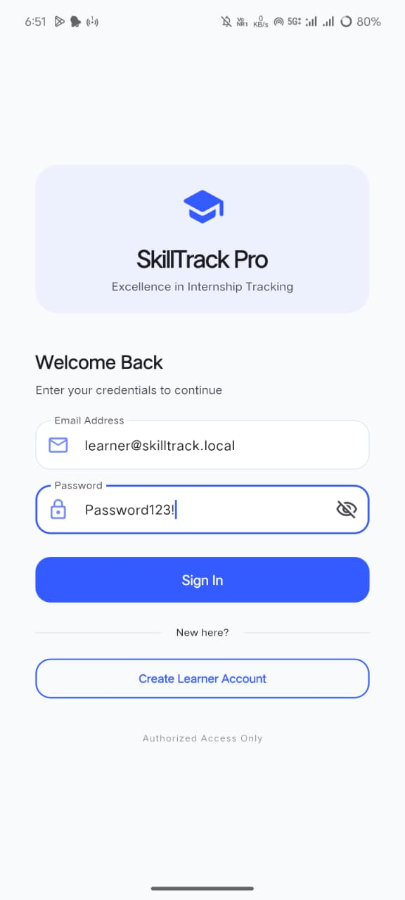
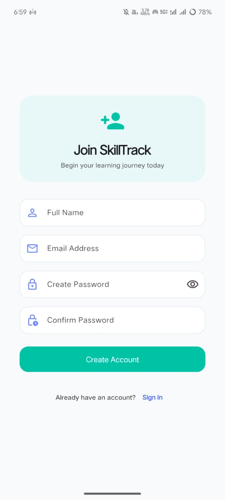
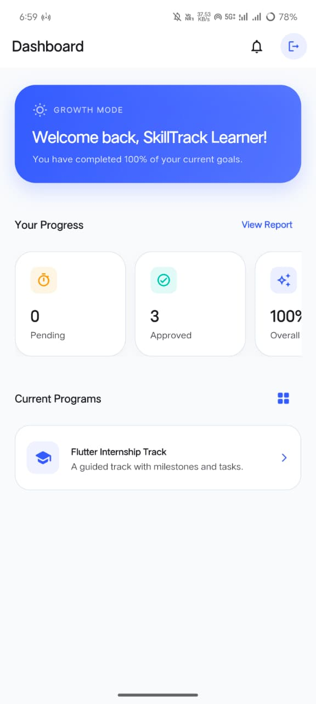
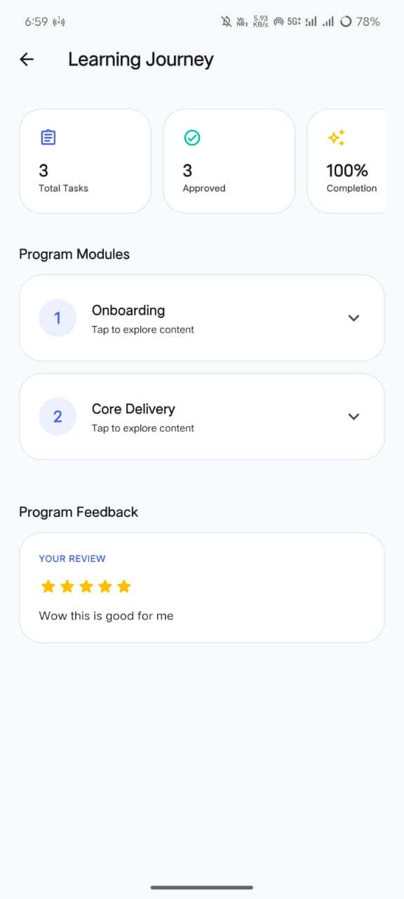

# SkillTrack Pro — Digital Scholastic Learning Platform

SkillTrack Pro is a premium, high-performance internship and curriculum management system. Built with a focus on **Visual Excellence** and **Technical Authority**, it provides a seamless bridge between learners, mentors, and administrators.

The application has undergone a comprehensive UI/UX overhaul, adopting the **"Digital Scholastic"** design system—a modern Indigo/Slate aesthetic characterized by structural clarity, vibrant accents, and smooth interactive patterns.

---

## 🎨 Design Philosophy: Digital Scholastic
- **Premium Aesthetics**: Vibrant indigo accents paired with clean slate surfaces.
- **Structural Clarity**: Heavy use of custom cards with 24-32px rounded corners and subtle shadows.
- **Modern Typography**: High-contrast pairings using **Outfit** for headers and **Inter** for readability.
- **Dynamic Feedback**: Micro-animations, skeleton loaders, and custom glassmorphism alerts.

---

## 📸 App Screenshots

### Authentication & Onboarding
<div align="center">
  
  
</div>

### Learner Dashboard
<div align="center">
  
  
</div>

### Task Management & Submissions
<div align="center">
  
</div>

---

## 🚀 Core Features

### For Learners
- **Learning Journey**: A specialized curriculum trail with status-coded progress tracking.
- **Deliverable Center**: Modern submission hub for tasks, resource links, and mentor feedback.
- **Sentiment Loop**: Post-course review system with star-rating visualizations.
- **Performance Reports**: Data-driven dashboards illustrating approved vs. rejected progress.

### For Mentors
- **Cohort Management**: High-level overview of all assigned learners and their activity timelines.
- **Precision Review**: Dedicated grading hub for evaluating submissions and providing qualitative feedback.
- **Knowledge Trail**: Vertical timeline views to visualize learner growth over time.

### For Admins
- **Management Hub**: Centralized console for managing users, programs, and system audit trails.
- **Curriculum Architecture**: Advanced tools to initialize programs, draft challenges, and provision milestones.
- **Governance Logs**: Institutional-grade activity tracking to monitor administrative actions.

---

## 🛠️ Repository Structure

- `backend/` — REST API (Node.js/Express + PostgreSQL)
- `frontend/` — Premium Flutter Application (iOS, Android, Web)

## 📖 Documentation

### 📚 API & Backend Documentation

Complete documentation for the SkillTrack Pro API is available in the [docs/](docs/) folder:

| Document | Purpose | Read Time |
|----------|---------|-----------|
| **[📍 Documentation Index](docs/DOCUMENTATION_INDEX.md)** | Central navigation hub for all docs | 5 min |
| **[⚡ Quick Start](docs/QUICK_START.md)** | Get up and running in 5 minutes | 10 min |
| **[🔌 API Documentation](docs/API_DOCUMENTATION.md)** | Complete reference for all 50+ endpoints | 40 min |
| **[💻 cURL Guide](docs/CURL_GUIDE.md)** | Master command-line API testing with examples | 25 min |
| **[🏗️ System Overview](docs/SYSTEM_OVERVIEW.md)** | Architecture, database schema, workflows | 15 min |
| **[🧪 Visual Testing Guide](docs/API_TESTING_VISUAL_GUIDE.md)** | Interactive testing workflows & debugging | 15 min |

**Quick Links:**
- 🚀 [Start here: Quick Start Guide](docs/QUICK_START.md)
- 📊 [View all endpoints: API Documentation](docs/API_DOCUMENTATION.md)
- 🔍 [Browse by topic: Documentation Index](docs/DOCUMENTATION_INDEX.md)

### Project Documentation

- **User Experience**: [docs/USER_MANUAL.md](docs/USER_MANUAL.md)
- **Technical Architecture**: [docs/DEVELOPER_GUIDE.md](docs/DEVELOPER_GUIDE.md)

---

## ⚡ Quickstart

### 1) Backend (Single Source of Truth)
```bash
cd backend
cp .env.example .env
npm install
npm run migrate
npm run seed
npm run dev
```
*API runs on `http://localhost:3000`*

### 2) Frontend (Visual UI)
```bash
cd frontend
flutter pub get

# Run on Emulator/Device
flutter run

# Run on Web (Chrome)
flutter run -d chrome
```

---

## 📦 Deployment & Build

To point the application at your production backend during the build process, use the `--dart-define` flag.

### Web Build
```bash
flutter build web --dart-define=API_BASE_URL=https://your-api.vercel.app
```

### Android Build (APK)
```bash
flutter build apk --release --dart-define=API_BASE_URL=https://your-api.vercel.app
```

---

## 📐 System Golden Rules
1. **The Backend is Authoritative**: All logic, RBAC, and validation live on the server.
2. **The Client is Temporary**: The app acts strictly as a high-performance UI consumer.
3. **The Database is Sacred**: Optimized indexing and atomic transactions ensure data integrity.
4. **Performance is a Feature**: Lightweight bundles, lazy-loaded components, and tree-shaking are mandatory.

---

Developed with ❤️ by Team Excelerate.